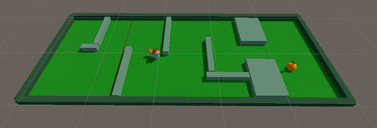
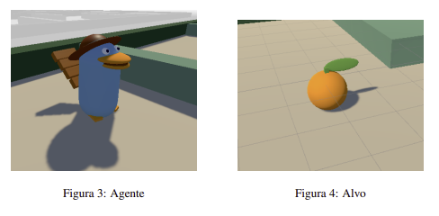

# Labyrinth_Game-Unity

In this work, an environment was created with an intelligent agent capable of navigating a maze and finding food.

Unity and ML-Agents were used to implement this work, utilizing the Proximal Policy Optimization (PPO) algorithm for reinforcement learning.

Based on this work, it was possible to conclude that the use of reinforcement learning in a non-trivial environment, through Unity with ML-Agents, is an effective approach to train autonomous agents, albeit with some limitations. By using partial and desired rewards, the agent was able to learn to make appropriate decisions to navigate our environment.

The use of the PPO algorithm allowed for optimizing the agent's performance over time by maximizing the cumulative reward function. Additionally, the incorporation of techniques such as the Ray Perception Sensor 3D and vector observations allowed the agent to gather detailed information about the environment, contributing to better decision-making. Another important factor was the exploration of the GAIL approach of imitation, which proved to be a promising strategy for overcoming the limitations of reinforcement learning.

Overall, this work highlighted the importance of considering different techniques and approaches in training autonomous agents, aiming to achieve superior performance in more complex environments.
